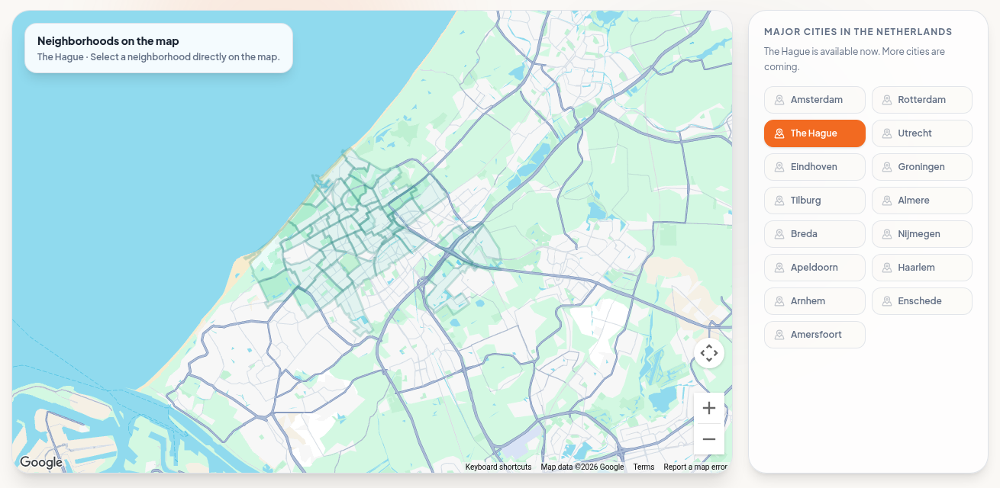

# BR-03 — Non-map discovery

## Enhancement assessment

**Priority:** P0 — Release gate

**Criticality:** Critical

**Complexity:** High

**Estimated effort:** 10–15 person-days (provisional)

This estimate covers the full existing implementation specification, not only copy: list-first and neighbourhood discovery, sorting/filter entry points, optional map and location flows, canonical history, all required states, accessibility, responsive behavior, and acceptance testing. Risk is high because discovery must remain complete when map resources, geolocation, or a source fail; complexity comes from coordinating URL state, result data, progressive map loading, and Back/Forward restoration. P0 is a proposed release gate for affected v0.4 journeys, not a verified production emergency or user-approved deadline.

**Work packages**

- List-first UX and state design: **2–3 person-days**
- List, neighbourhood, and progressive-map implementation: **4–6 person-days**
- Search/API and canonical-history integration: **2–3 person-days**
- Accessibility, responsive, and state QA: **2–3 person-days**

**Estimation basis and exclusions:** The range excludes global rollout or dataset acquisition, ongoing verification operations, and third-party or legal lead times. Existing core search, authentication, and data contracts are presumed reusable; if they are absent or materially incompatible, re-estimate. Person-days are combined design, engineering, and QA effort, not elapsed delivery time, and overlap across BRs must not be summed blindly. [Assessment definitions and estimation basis](./requirements.md#assessment-definitions-and-estimation-basis)

## Specification status

- This document describes **proposed requirements**, not implemented or verified behavior.
- `requirements.md` is the source of truth for BR-03.
- The live consumer stack, search services, data coverage, map provider, and existing API contracts are unknown and must be inspected during implementation.
- The workspace report viewer and weekend guide are not the live consumer application.
- Counts, timings, and layout thresholds below are proposed delivery targets, not measured current performance.

## Exact business requirement

> Consumers must be able to discover places through a usable list or neighbourhood-browse alternative without depending on the map.

## Objective

Make list and neighbourhood discovery complete primary paths. A consumer must be able to find and open useful place information without granting location permission, downloading a map SDK, manipulating a map, or creating an account.

## Scope

- Search-results list as the default discovery presentation.
- Manual Hague neighbourhood browse.
- List sorting and compatible category/filter entry points.
- Explicit “Show map” progressive enhancement.
- Explicit “Use my location” with a manual neighbourhood alternative.
- Loading, success, empty, error, permission-denied, guest, and account behavior.
- Canonical criteria URLs and Back/Forward restoration.
- Mobile and accessible list interactions.

## Non-goals

- Specifying map marker clustering, tile styling, or provider selection.
- Requiring geolocation for relevance.
- Guaranteeing that every Hague place or neighbourhood is represented.
- Defining all result-card fields and next actions covered by BR-10.
- Adding unsupported verification badges or allergy-safety claims.
- Expanding current availability beyond The Hague.

## Current-state evidence

*Current desktop baseline captured 18 September 2026. This is not a target design and is not evidence of mobile, authentication, results, keyboard, or network behavior.*

*Current desktop map-and-city crop captured 18 September 2026. The baseline visibly instructs “Select a neighborhood directly on the map.” This is current visual evidence only; it does not prove map interaction, list availability, permission behavior, result coverage, or data completeness.*

### Precise observation

- A map and city coverage presentation are prominent in the captured homepage.
- The visible instruction explicitly says “Select a neighborhood directly on the map”; this specification does not claim that map instructions are missing.
- The capture does not demonstrate an equivalent complete list or manual neighbourhood-browse flow.
- The screenshot cannot establish whether the map SDK loaded at page entry, whether location permission is requested, or whether search can complete without the map.
- No inference may be made about live neighbourhood inventory, result ranking, backend endpoints, keyboard use, mobile reflow, or failure handling.

## Target screens

1. **Homepage, fresh session:** local-only search and manual neighbourhood browse are primary; map is not initialized.
2. **Neighbourhood index:** Hague neighbourhoods shown as semantic links or buttons with optional categories.
3. **List results:** criteria summary, source scope, result count/status, filters, sorting, and explicit “Show map.”
4. **Map progressive enhancement:** map appears only after activation while list remains available.
5. **Location denied:** manual neighbourhood selection, query, and list are retained.
6. **Mobile results:** list appears before map disclosure and supports one-column reflow.
7. **Place detail return:** Back returns to prior criteria, list position, and focus where technically feasible.

## Numbered interaction flows

### Flow 1 — Browse a neighbourhood without a map

1. **Entry:** A guest or account consumer opens the homepage.
2. **UI state:** Search, neighbourhood browse, and Hague-only notice are available; no map request starts.
3. **Action:** The consumer opens neighbourhood browse.
4. **UI response:** A semantic list of available Hague neighbourhoods loads with progress announcement.
5. **Selection:** The consumer selects a neighbourhood.
6. **Success:** List results appear with the neighbourhood and local scope visible.
7. **Persisted state:** Canonical URL records validated city, neighbourhood, locale, and other active shareable criteria.
8. **Back:** Back restores the neighbourhood index and prior focus/scroll where feasible.
9. **Retry:** Failure retains selection and offers retry.

### Flow 2 — Search and refine the list

1. **Entry:** The consumer enters query or category with optional neighbourhood.
2. **Action:** The consumer submits search.
3. **UI response:** A labelled list loading state appears; controls remain understandable.
4. **Success:** Results render in deterministic groups with criteria and active filters.
5. **Refine:** Changing a filter updates URL/history and announces completion.
6. **Empty:** Zero matches show specific recovery actions without implying that no places exist.
7. **Error:** A request error is differentiated from an empty result and retains criteria.

### Flow 3 — Explicitly show the map

1. **Entry:** List results are already usable.
2. **Action:** The consumer activates “Show map.”
3. **UI response:** Map code begins loading and a labelled progress state appears.
4. **Success:** Map is added as a synchronized optional view; the list remains available.
5. **Map error:** The failure is scoped to the map; list results and actions remain usable.
6. **Cancel/hide:** “Hide map” removes or collapses the view without clearing criteria.
7. **Back:** History behavior follows the agreed view-state policy without losing search criteria.

### Flow 4 — Use or decline location

1. **Entry:** The consumer sees separate “Use my location” and manual neighbourhood actions.
2. **Action:** Selecting “Use my location” triggers the only geolocation request in the flow.
3. **Success:** A coarse consumer-readable area may update after explicit confirmation under the privacy policy.
4. **Denied:** An inline message explains that location was not used and links to manual selection.
5. **Unavailable/error:** The same manual path is offered without repeated prompts.
6. **Privacy:** Coordinates do not enter share URLs, analytics, logs intended for product measurement, or visible history.

### Flow 5 — Opt into web results

1. **Entry:** Local-only results or an empty local state are visible.
2. **Action:** The consumer explicitly enables “Include web results.”
3. **UI response:** Scope description appears before or with activation.
4. **Success:** Web results load in a separate labelled group with available source/date/status.
5. **Cancel:** Disabling the option removes the web group while retaining other criteria.
6. **Persisted state:** Only the scope enum, not private preference history, enters the canonical URL.

## Canonical state and history

- Proposed shareable keys: `city`, `neighbourhood`, `query`, `category`, `filters`, `scope`, and `locale`.
- Excluded: latitude/longitude, precision, location history, private preferences, account identifiers, sessions, and tokens.
- Validate values against supported cities, known neighbourhood identifiers, filter allow-lists, safe lengths, and supported locales.
- Invalid criteria must yield safe defaults plus a clear correction, never an unhandled screen.
- Shared links must recreate equivalent criteria and list-first presentation.
- Browser Back/Forward must preserve criteria and meaningful refinements.
- The final route form must be reconciled with live consumer contracts.

## Required states

| State | Proposed behavior |
|---|---|
| Initial | Search and Hague neighbourhood browse are available; local-only; no map or location request. |
| Loading | Skeleton or progress region preserves criteria and announces list loading. |
| Success | List is primary, source groups are clear, and results can be opened without map. |
| Empty | Explain no match for current criteria; offer clear filters, neighbourhood change, and optional web scope. |
| Error | Distinguish service failure from zero matches; retain criteria and offer retry. |
| Permission denied | State that location was not used; manual neighbourhood and list stay available. |
| Guest | Browse, search, refine, share, and open results without account. |
| Account | Same discovery path; account-backed favourites may appear without changing list availability. |

## Desired and undesired behavior

| Desired behavior | Undesired behavior |
|---|---|
| List works before and without map. | List waits for map SDK, tiles, or marker success. |
| Manual neighbourhood browse is first-class. | Location permission is the only way to establish area. |
| Map loads after explicit “Show map.” | Map packages or provider requests begin on homepage load. |
| Permission denial has a calm fallback. | Repeated prompts, dead ends, or degraded search after denial. |
| Local/web groups remain distinct. | Provenance-obscuring blended ranking. |
| Empty and error states differ. | Network failure displayed as “no places found.” |
| Shared URLs preserve safe criteria. | Coordinates or private preferences leak in links. |
| Guest browsing remains complete. | Sign-in required before results or neighbourhood browse. |

## Proposed technical implementation

### Frontend

1. Inspect live routing, search state, result components, map imports, geolocation calls, and localization.
2. Establish a list-first discovery controller independent of map state and provider types.
3. Build a semantic neighbourhood index using stable identifiers and localized display names.
4. Dynamically import the map boundary only in response to “Show map”; verify no eager transitive map import.
5. Separate location action state from map visibility and search scope.
6. Add criteria serialization/parser with allow-lists and deterministic ordering.
7. Preserve focus on refinements; announce result updates without moving focus unexpectedly.
8. Restore list position/focus on detail return where router capabilities permit.

### Proposed data/API contracts

- Proposed neighbourhood item: `{ id, cityId, names: { nl, en }, availabilityStatus }`.
- Proposed search request: `{ city, neighbourhood?, query?, category?, filters?, scope, locale, cursor? }`.
- Proposed grouped response: `{ groups: [{ sourceGroup, items, nextCursor? }], totalStatus, notices }`.
- Proposed `sourceGroup` values may distinguish `local` and `web`; exact enums must match existing contracts.
- Result fields requiring trust context should support source, checked date, and status at field level; unknown remains explicit.
- No claim is made that these endpoints or fields exist. Inspect and reconcile with live APIs, pagination, errors, caching, and authorization.

### Integration

- BR-04 governs scope disclosure and opt-in.
- BR-05 supplies approved Hague neighbourhood/category vocabulary.
- BR-07 governs source/date/status display.
- BR-10 supplies card fields and next actions.
- Keep favourites account-backed under BR-11 while retaining full guest browsing and return context after sign-in.
- Avoid recording query text, coordinates, or result selections containing sensitive inferences in general analytics.

### Privacy and accessibility

- Target WCAG 2.2 AA.
- Use headings and list semantics; expose result update status without excessive announcements.
- Provide keyboard-equivalent actions for all functionality; map gestures are never required.
- Meet focus, contrast, target-size, reflow, and zoom requirements in both locales.
- Explain location purpose before the browser prompt and minimize precision/retention under BR-08.
- Do not place coordinates, tokens, or private preferences in URLs.

### Rollout

1. Audit whether current search is coupled to map lifecycle.
2. Decouple and ship list-first behavior behind an existing rollout mechanism if available.
3. Validate Hague neighbourhood names and availability without inventing coverage.
4. Test with map blocked, location denied, slow network, empty/error APIs, guest/account, and both locales.
5. Monitor list success and map opt-in with privacy-minimized events.
6. Roll back optional map changes independently from list discovery.

## Dependencies

- **BR-01:** communicates list-first value and Hague availability.
- **BR-02:** labels list, neighbourhood, map, and location actions.
- **BR-04:** defines local versus web scope.
- **BR-05:** provides Hague neighbourhood/category context.
- **BR-06:** requires a non-map accessible equivalent.
- **BR-07:** defines evidence presentation.
- **BR-08:** controls geolocation and data handling.
- **BR-09:** requires mobile-first reflow and lazy map.
- **BR-10:** defines practical list cards, filters, and actions.
- **BR-11:** governs account-backed favourites and context-preserving sign-in.
- **BR-12:** ensures Dutch-English parity.

## Measurable acceptance criteria

1. **BR-03-AC-01:** A fresh session exposes local-only search and manual Hague neighbourhood browse without initializing map code.
2. **BR-03-AC-02:** A guest can select a neighbourhood, receive list results, and open a result without geolocation or account access.
3. **BR-03-AC-03:** Map assets/provider calls begin only after explicit “Show map.”
4. **BR-03-AC-04:** A map load failure does not block, clear, or disable list discovery.
5. **BR-03-AC-05:** Geolocation is requested only after “Use my location,” and denial leaves a manual neighbourhood alternative.
6. **BR-03-AC-06:** Local and opted-in web results render as separately labelled source groups.
7. **BR-03-AC-07:** Empty and service-error states are distinct, retain criteria, and expose relevant recovery actions.
8. **BR-03-AC-08:** Canonical links recreate validated city, neighbourhood, query, category, filters, scope, and locale while excluding sensitive state.
9. **BR-03-AC-09:** Back/Forward and detail return preserve criteria and restore usable list context.
10. **BR-03-AC-10:** Hague-only availability and unknown source/date/status values are explicit where applicable.
11. **BR-03-AC-11:** Account-backed favourites do not reduce guest browse/search access, and sign-in return preserves discovery context.
12. **BR-03-AC-12:** List and neighbourhood discovery meet agreed WCAG 2.2 AA checks in Dutch and English at mobile and desktop sizes.

## Test cases

| Test ID | AC IDs | Preconditions | Steps | Expected result | Level |
|---|---|---|---|---|---|
| BR-03-TC-01 | 01 | Fresh guest; requests observable | Open homepage and neighbourhood browse | Local-only list path appears; no map/provider/location request | E2E |
| BR-03-TC-02 | 02 | Signed out | Select neighbourhood; open a list item | Flow completes without sign-in or map | E2E |
| BR-03-TC-03 | 03 | List results present | Inspect requests; activate “Show map” | Map requests start only after activation | Integration |
| BR-03-TC-04 | 04 | Block map assets/provider | Show map | Scoped map error appears; list remains usable | E2E |
| BR-03-TC-05 | 05 | Location undecided | Use location; deny | One prompt follows action; manual fallback remains | E2E |
| BR-03-TC-06 | 06 | Web results available | Search fresh; opt into web | Initially local-only; distinct web group appears after opt-in | Integration |
| BR-03-TC-07 | 07 | Search returns zero | Submit criteria | Empty explanation and refinements appear; no error claim | Integration |
| BR-03-TC-08 | 07 | Search service fails | Submit and retry | Error differs from empty; criteria persist; retry works | Integration |
| BR-03-TC-09 | 08 | Complex safe criteria | Copy and open URL in fresh session | Equivalent validated list criteria load; no sensitive values | E2E |
| BR-03-TC-10 | 08 | Malformed/overlong parameters | Open URL | Inputs are normalized/rejected with recovery state | Security |
| BR-03-TC-11 | 09 | Results scrolled; item focused | Open detail; use Back | Criteria and usable list context restore | E2E |
| BR-03-TC-12 | 10 | Unknown metadata fixture | Render list | Unknown is explicit; no badge or safety guarantee appears | Component |
| BR-03-TC-13 | 11 | Guest favourites attempt | Browse; choose favourite; cancel/sign in | Browse remains; sign-in return preserves context; save requires account | E2E |
| BR-03-TC-14 | 12 | Keyboard and screen reader | Browse, refine, open result | Logical focus and meaningful status/list semantics | Accessibility |

## Future screenshot capture matrix

| Capture ID | Viewport/state | Required visible evidence | Evidence limit |
|---|---|---|---|
| BR-03-SS-01 | Desktop, fresh guest | Search, Hague notice, neighbourhood browse, no map surface | Screenshot cannot prove no network call |
| BR-03-SS-02 | Desktop, neighbourhood index | Semantic-looking Hague browse and current locale | Do not imply complete coverage |
| BR-03-SS-03 | Desktop, list success | Criteria, source group, cards, “Show map” | No fabricated places |
| BR-03-SS-04 | Desktop, map open | Synchronized optional map and retained list | Not proof of accessibility |

Future captures must be generated from the implemented live consumer experience and labeled with build, date, locale, viewport, and state. They are not completed evidence until the relevant implementation and tests have passed.