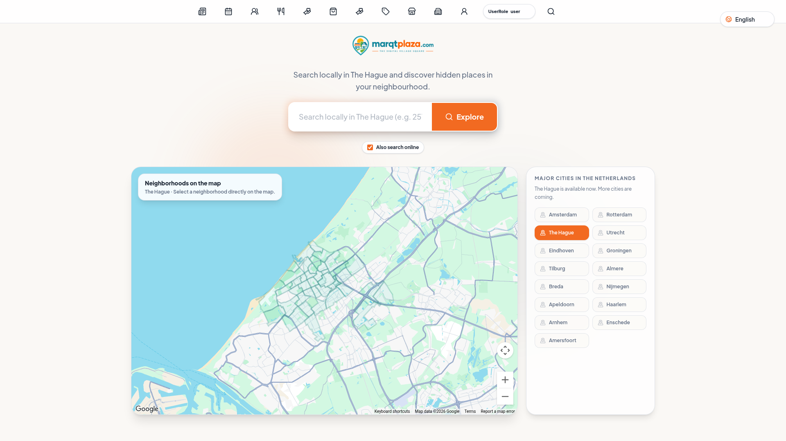

# BR-09 — Mobile-first experience

## Enhancement assessment

**Priority:** P1 — High

**Criticality:** High

**Complexity:** High

**Estimated effort:** 10–15 person-days (provisional)

This estimate covers the full existing implementation specification, not only copy: mobile-first reflow, navigation and disclosure, complete narrow-width discovery, map lazy-loading, state persistence, touch/focus/zoom/orientation/keyboard behavior, bilingual layouts, and acceptance testing. Risk is high because desktop assumptions or eager map loading can make the primary journey unusable on mobile; complexity is high due to cross-screen responsive changes and preservation of state through list, map, auth, and history transitions.

**Work packages**

- Mobile information hierarchy and interaction design: **2–3 person-days**
- Responsive screens and disclosure implementation: **4–6 person-days**
- Map lazy-loading and cross-view state integration: **2–3 person-days**
- Device, accessibility, localization, and state QA: **2–3 person-days**

**Estimation basis and exclusions:** The range excludes global rollout or dataset acquisition, ongoing verification operations, and third-party or legal lead times. Existing core search, authentication, and data contracts are presumed reusable; if they are absent or materially incompatible, re-estimate. Person-days are combined design, engineering, and QA effort, not elapsed delivery time, and overlap across BRs must not be summed blindly. [Assessment definitions and estimation basis](./requirements.md#assessment-definitions-and-estimation-basis)

## Status and interpretation

This document is a proposed implementation specification, not a description of implemented or verified behavior.
The live consumer stack, component model, analytics, APIs, and deployment constraints are unknown and must be inspected during implementation.
The workspace report viewer and weekend guide are reference artifacts, not the live consumer application.
Any dimensions, timing budgets, or performance thresholds below are proposed delivery targets, not measured facts.

## Exact business requirement

> The consumer experience must support mobile-first reflow, progressive disclosure, and map lazy-loading rather than rely on a desktop-first composition.

## Objective

Deliver a complete discovery journey at narrow widths without horizontal scrolling, obscured controls, or dependence on a map.
Prioritize query entry, neighbourhood browsing, filters, result review, and next actions in a single-column information hierarchy.
Load the map SDK and map data only after an explicit **Show map** action.
Offer **Use my location** only as an optional action and retain a manual neighbourhood alternative.
Maintain the same criteria and state when consumers switch between list and map presentations.

## Scope

- Responsive consumer homepage, search, neighbourhood browse, result list, result detail, filters, and account prompts.
- Mobile navigation labels and hierarchy, including an understandable replacement for the current icon row.
- Progressive disclosure for filters, source details, trust details, privacy explanations, and secondary result actions.
- Touch target, focus, zoom, orientation, virtual-keyboard, safe-area, and reduced-motion behavior.
- Mobile state persistence across list/map changes, history navigation, sign-in prompts, and shared URLs.
- Current Hague-only availability messaging at mobile sizes.
- Dutch and English parity for all new mobile copy.

## Non-goals

- A native iOS or Android application.
- Offline maps or offline result synchronization.
- Background location tracking, continuous location monitoring, or storage of raw coordinates in shared URLs.
- Making geolocation, map permission, or map SDK availability a prerequisite for discovery.
- Redesigning provider-owned map tiles or browser permission dialogs.
- Claiming support outside The Hague before that availability exists.
- Treating desktop screenshots as proof of mobile behavior.

## Current-state evidence

*Figure 1. CURRENT desktop baseline captured 18 September 2026. This is not a target design and is not evidence of mobile, authentication, results, keyboard, permission, or network behavior.*

*Figure 2. CURRENT desktop crop captured 18 September 2026: the top icon row, “UserRole user,” and “English.” This crop is not a target design and does not establish narrow-width reflow or accessible names.*

### Precise observation

The captured desktop viewport presents a wide composition with a top icon row, search content, and a map/city region.
The page visibly identifies current availability around The Hague.
The map instruction says **“Select a neighborhood directly on the map.”**
The evidence supports only what is visible in the captured desktop frame.
It does not establish breakpoints, source order, touch targets, map lazy-loading, zoom support, landscape behavior, keyboard avoidance, or screen-reader behavior.
It does not establish whether geolocation is requested, whether criteria persist, or whether the map SDK is already loaded.

## Target screens

1. **Mobile discovery home:** value statement, Hague availability, query input, local-only default, neighbourhood/category entry points, and primary search action.
2. **Mobile list results:** applied criteria, result count/status, filter and sort entry points, source groups, cards, and explicit next actions.
3. **Mobile filters sheet/page:** categorized controls, clear/apply actions, result preview count when supported, and non-modal fallback.
4. **Mobile result detail:** essential facts first, source/date/status fields, unknown values stated as unknown, then secondary detail.
5. **Mobile map opt-in:** explanation and **Show map** action before map resources load; list remains available.
6. **Mobile map view:** map plus list-return control, selected result summary, manual neighbourhood control, and optional **Use my location**.
7. **Mobile navigation menu:** text labels, current location, language choice, account value entry point, and close behavior.
8. **Mobile permission/error state:** clear recovery from denied location, map failure, search failure, or offline state.

## Interaction flows

### Flow 1 — Fresh-session local list discovery

1. **Entry:** Consumer opens the homepage at a narrow viewport with no saved search state.
2. **Initial UI:** Search is available immediately; local-only scope is the default and Hague-only availability is explicit.
3. **Action:** Consumer enters a query and optionally chooses city, neighbourhood, category, or filters.
4. **UI response:** Submission shows an announced loading state without replacing criteria or shifting focus unexpectedly.
5. **Success:** Results appear as a list grouped by source where applicable; the map SDK has not loaded.
6. **Persisted state:** Canonical URL stores city, neighbourhood, query, category, filters, scope, and locale.
7. **Excluded state:** Coordinates, private preferences, and tokens are never placed in the URL.
8. **Back:** Browser Back restores criteria, scroll position where feasible, and the preceding screen.
9. **Retry:** A failed request keeps criteria and offers Retry.

### Flow 2 — Progressive filter use

1. **Entry:** Consumer selects **Filters** from list results.
2. **UI response:** A mobile sheet or dedicated route opens with a visible heading and close/back control.
3. **Action:** Consumer changes filters and selects **Apply**.
4. **Success:** The list refreshes, applied filters are summarized, and focus moves to the results status.
5. **Cancel:** Close/Back discards unapplied changes and restores focus to **Filters**.
6. **Persisted state:** Applied filters update the validated canonical URL and history.
7. **Error:** Failure retains applied criteria and supports retry without reopening every control.

### Flow 3 — Explicit map loading

1. **Entry:** Consumer is on home or list results; no map dependency is required.
2. **Action:** Consumer activates **Show map**.
3. **UI response:** The product explains that a map resource will load, then presents an accessible loading status.
4. **Success:** The map loads with the current result criteria and a visible **Show list** action.
5. **Persisted state:** Presentation mode may be represented in history, but coordinates remain excluded from shared URLs.
6. **Back:** Back returns to the prior list state without clearing criteria.
7. **Failure:** A map load error leaves list discovery fully usable and offers Retry.
8. **Cancel:** Leaving before load completion returns to the list and does not block other actions.

### Flow 4 — Optional location

1. **Entry:** Consumer opens map or neighbourhood selection.
2. **Action:** Consumer selects **Use my location**; no permission request occurs before this action.
3. **UI response:** Purpose and use are explained before or alongside the browser permission prompt.
4. **Allowed:** Approximate/current position supports nearby discovery according to the privacy policy.
5. **Denied:** The UI states that location was not used and offers manual neighbourhood selection.
6. **Unavailable:** Timeout or device failure yields the same manual alternative.
7. **Persisted state:** Raw coordinates are not added to shared URLs or retained as a private preference without informed choice.
8. **Retry:** Consumer can retry location from an explicit control.

### Flow 5 — Mobile navigation and account detour

1. **Entry:** Consumer opens the labeled menu.
2. **Action:** Consumer chooses account/favourites while browsing as a guest.
3. **UI response:** Account benefits and sign-in requirement are explained without removing guest browsing.
4. **Cancel:** Closing the prompt returns to the same search/result and scroll context.
5. **Success:** Sign-in returns to the initiating context; favourites remain account-backed only.
6. **Back:** History does not trap the consumer between menu overlays.

### Flow 6 — Orientation and virtual keyboard

1. **Entry:** Consumer focuses the query or filter field.
2. **UI response:** The focused field, label, validation, and primary action remain reachable above the virtual keyboard.
3. **Action:** Consumer rotates the device or zooms to 200–400%.
4. **Success:** Content reflows without two-dimensional scrolling except intrinsically spatial map content.
5. **Recovery:** Dismissal of the keyboard does not clear input or jump to page start.

## Desired and undesired behavior

| Area | Desired behavior | Undesired behavior |
|---|---|---|
| Discovery | Complete list journey without permission or map SDK | Blank or blocked results until a map loads |
| Map | Loads only after explicit **Show map** | Eager SDK, tile, or location loading on entry |
| Location | Requested only after **Use my location** | Prompt on page load or implied consent |
| Layout | Logical single-column reflow | Shrunken desktop canvas or horizontal scroll |
| Disclosure | Essential content first; secondary detail expandable | Critical facts hidden behind unexplained icons |
| Navigation | Text labels and clear current location | Icon-only controls or ambiguous “UserRole user” |
| State | Criteria survive mode, auth, Back, and retry | Query/filter loss after detours |
| URL | Validated public criteria only | Coordinates, tokens, or private preferences exposed |
| Results | Useful cards and explicit actions | Map pin as the only route to detail |
| Accessibility | WCAG 2.2 AA target, stable focus, 400% reflow | focus traps, clipped zoom, color-only state |
| Localization | Dutch-English parity and stable layout | Truncation or mixed-language mobile controls |
| Geography | Hague-only availability stated clearly | Implying unsupported city coverage |

## Required state behavior

### Initial

- Render server/static shell and list-first controls without map code as far as the inspected stack permits.
- Default a fresh session to local-only search; **Include web results** is an explicit opt-in.
- Present manual neighbourhood browsing without requiring location.
- Do not infer consent from a previously viewed map unless valid consent/state rules explicitly support it.

### Loading

- Keep query and criteria visible.
- Use a programmatically determinable, politely announced status.
- Avoid layout jumps; skeletons must preserve semantics and not be focusable.
- Map loading must not disable list navigation.

### Success

- Show results as usable cards with source grouping when web scope is enabled.
- Preserve canonical criteria across history and presentation changes.
- Restore focus predictably after sheets, dialogs, and navigation.

### Empty

- State which criteria produced no matches.
- Offer clear filters, manual neighbourhood changes, or optional web-results opt-in.
- Do not automatically broaden scope without consent.

### Error

- Distinguish search error, map error, validation error, and offline/network error.
- Retain input and offer a targeted retry.
- Never convert a map failure into a full discovery failure.

### Permission denied

- Explain that location was not used.
- Keep manual neighbourhood and list discovery available.
- Do not repeatedly trigger the browser prompt.

### Guest and account

- Guests can search, browse lists, inspect details, use the map, and share public criteria.
- Favourites are account-backed only.
- A sign-in detour preserves the initiating context and returns safely on success or cancel.
- No private account preference enters a public shared URL.

## Technical implementation plan

### Discovery and audit

1. Inspect the live consumer repository, routes, rendering mode, CSS strategy, map provider, and existing APIs before selecting implementation details.
2. Record actual breakpoints, map bundle requests, focus order, and current URL behavior; do not infer them from the desktop screenshot.
3. Inventory shared components and all Dutch/English strings affected by reflow.

### Frontend

4. Establish mobile-first base styles, adding min-width enhancements rather than desktop-first overrides.
5. Use semantic landmarks and DOM order matching the reading/task order.
6. Implement list mode as the initial discovery surface.
7. Gate dynamic map import, SDK initialization, tile requests, and map data behind **Show map**.
8. Provide a labeled menu with focus management, Escape handling where applicable, and trigger focus restoration.
9. Implement filter disclosure as an accessible dialog, sheet, or route based on inspected framework capabilities.
10. Ensure controls meet WCAG 2.2 AA target, including visible focus and minimum target-size considerations.
11. Test CSS safe-area insets, browser chrome, portrait/landscape, text spacing, and 400% zoom.
12. Respect reduced motion and avoid mandatory drag gestures.

### Proposed state and URL interface

13. Define a validated public state shape: `city`, `neighbourhood`, `query`, `category`, `filters`, `scope`, `locale`, and optional presentation mode.
14. Treat this shape as proposed until reconciled with existing routes and contracts.
15. Parse unknown/invalid values safely, announce corrections when consequential, and never execute untrusted URL content.
16. Keep coordinates, private preferences, session identifiers, and auth tokens outside URLs and analytics payloads.
17. Use shared history so Back/Forward restores criteria rather than generating duplicate searches.

### Proposed API integration

18. Reconcile the existing search contract before proposing changes.
19. If needed, propose `GET /api/discovery` with validated criteria and paginated list results independent of map bounds.
20. If needed, propose a separate map-data request after opt-in rather than making map geometry mandatory for list results.
21. Return structured error codes, source group, source/date/status fields, and explicit unknown values; do not invent verification or allergy assurances.
22. Support cancellation/debouncing without silently discarding the latest criteria.

### Privacy, accessibility, and localization

23. Request geolocation only from **Use my location**, with purpose, retention, and deletion explanations aligned to BR-08.
24. Perform keyboard, screen-reader, touch, switch, zoom, contrast, and reduced-motion checks against WCAG 2.2 AA.
25. Add Dutch and English strings together; test longer translations and consistent `Den Haag`/`The Hague` terminology by locale.
26. Avoid logging query/location combinations beyond approved minimization and retention rules.

### Rollout

27. Release behind a reversible feature flag if the live architecture supports flags.
28. Compare list success, map opt-in, location-denial recovery, errors, and performance using privacy-approved aggregate telemetry.
29. Set proposed budgets during implementation, such as no map SDK request before opt-in and no horizontal overflow at supported widths.
30. Provide fallback to list-first discovery if map integration regresses.

## Dependencies

- **BR-01:** mobile hierarchy must retain the value proposition.
- **BR-02:** navigation needs labels and understandable hierarchy.
- **BR-03:** list and neighbourhood discovery must work without map permission or SDK.
- **BR-04:** fresh-session local-only default and explicit web-results opt-in.
- **BR-05:** Hague neighbourhoods and local categories supply mobile browse choices.
- **BR-06:** accessibility requirements govern reflow, focus, semantics, and alternatives.
- **BR-07:** cards/details need source, date, status, caveats, and explicit unknowns.
- **BR-08:** location, scope, retention, and deletion explanations govern consent.
- **BR-10:** cards, filters, and actions define the mobile result journey.
- **BR-11:** guest browsing and context-preserving sign-in.
- **BR-12:** Dutch-English parity and geographical terminology.

## Acceptance criteria

1. **BR-09-AC-01:** At 320 CSS px width through supported desktop widths, core discovery has no page-level horizontal scrolling and no clipped primary action.
2. **BR-09-AC-02:** A fresh session can complete query-to-list-detail discovery without loading a map SDK or granting map/location permission.
3. **BR-09-AC-03:** No map SDK, tile, or map-data request starts before explicit **Show map** activation.
4. **BR-09-AC-04:** Geolocation is requested only after **Use my location**, and denial leaves a manual neighbourhood alternative.
5. **BR-09-AC-05:** Initial search scope is local-only; web results require explicit opt-in and are visibly source-grouped.
6. **BR-09-AC-06:** Canonical URLs contain validated city, neighbourhood, query, category, filters, scope, and locale as applicable, but no coordinates, private preferences, or tokens.
7. **BR-09-AC-07:** Back/Forward, list/map switching, retry, and sign-in cancel preserve applicable criteria and context.
8. **BR-09-AC-08:** Loading, empty, error, and permission-denied states are labeled, announced where appropriate, and recoverable.
9. **BR-09-AC-09:** Keyboard focus remains visible and logical through menu, filters, results, map opt-in, and dialogs.
10. **BR-09-AC-10:** Content reflows at 400% zoom and remains usable in portrait and landscape, excluding intrinsic two-dimensional map panning.
11. **BR-09-AC-11:** Guest discovery remains available; favourite actions explain account need and successful sign-in restores context.
12. **BR-09-AC-12:** All new mobile copy exists in Dutch and English with locale-consistent Hague terminology.
13. **BR-09-AC-13:** The interface states current Hague-only availability without implying unsupported coverage.
14. **BR-09-AC-14:** Map failure never removes or disables the equivalent list discovery path.

## Test cases

| Test ID | AC mapping | Preconditions | Steps | Expected result | Level |
|---|---|---|---|---|---|
| BR-09-TC-01 | AC-01, AC-02 | Fresh session, 320px viewport | Search and open a result | No horizontal overflow; list journey completes without map | E2E/mobile |
| BR-09-TC-02 | AC-03 | Network recorder, fresh page | Load home, search, inspect requests, then select Show map | No map request before action; requests begin afterward | Integration |
| BR-09-TC-03 | AC-04, AC-14 | Location permission denied | Select Use my location, deny, choose neighbourhood | Denial is explained; manual list discovery succeeds | E2E/negative |
| BR-09-TC-04 | AC-05 | Cleared storage | Search, then opt into web results | First search is local-only; second is grouped by source | E2E |
| BR-09-TC-05 | AC-06 | Search criteria available | Apply all criteria and copy URL | Allowed fields round-trip; sensitive fields absent | Integration/security |
| BR-09-TC-06 | AC-07 | Results and filter state | Open detail, Back, map/list switch, cancel sign-in | Criteria and relevant scroll/context persist | E2E |
| BR-09-TC-07 | AC-08 | Simulated search and map failures | Trigger each state and retry | Specific message, retained input, working retry/list fallback | E2E/negative |
| BR-09-TC-08 | AC-09 | Keyboard only | Traverse menu, filters, cards, dialogs | Logical order, visible focus, no trap, focus restored | Accessibility |
| BR-09-TC-09 | AC-10 | 400% zoom and landscape | Complete core journey | Controls remain readable and operable | Accessibility/mobile |
| BR-09-TC-10 | AC-11 | Guest session | Browse, favourite, cancel then complete sign-in | Browse remains; prompt explains value; context returns | E2E |
| BR-09-TC-11 | AC-12, AC-13 | NL and EN locales | Review all mobile states | Complete parity; locale-correct Hague label; coverage clear | Localization |
| BR-09-TC-12 | AC-01, AC-09 | Touch device and screen reader | Operate primary controls | Targets and names are usable; status changes announced | Accessibility/mobile |
| BR-09-TC-13 | AC-14 | Map provider blocked | Search list, attempt map, return to list | List remains intact and actionable | Integration/negative |
| BR-09-TC-14 | AC-07 | Slow response | Submit, navigate/cancel, retry latest search | No stale response overwrites current state | Integration |

## Future screenshot capture matrix

These captures are required after implementation; none is claimed complete here.

| Capture ID | Viewport/state | Required evidence |
|---|---|---|
| BR-09-SS-01 | 390×844, fresh home EN | Single-column hierarchy, Hague-only message, local-only default |
| BR-09-SS-02 | 390×844, list success NL | Dutch list cards, filters, source grouping, next actions |
| BR-09-SS-03 | 390×844, filters open | Heading, close/apply controls, visible focus |
| BR-09-SS-04 | 390×844, pre-map | Explicit Show map action and usable list |
| BR-09-SS-05 | 390×844, map loaded | Show list, selected summary, manual neighbourhood option |
| BR-09-SS-06 | 390×844, permission denied | Explanation and manual neighbourhood recovery |
| BR-09-SS-07 | 844×390, landscape | Reflow with keyboard-safe controls |
| BR-09-SS-08 | 320px, 400% zoom equivalent | No clipped content or page-level horizontal scroll |
| BR-09-SS-09 | 390×844, empty/error | Retained criteria and recovery actions |
| BR-09-SS-10 | 390×844, guest favourite prompt | Account value, cancel, and preserved context |

Capture both locales where copy differs, redact personal data, and record browser, OS, viewport, build, locale, and state setup with each image.