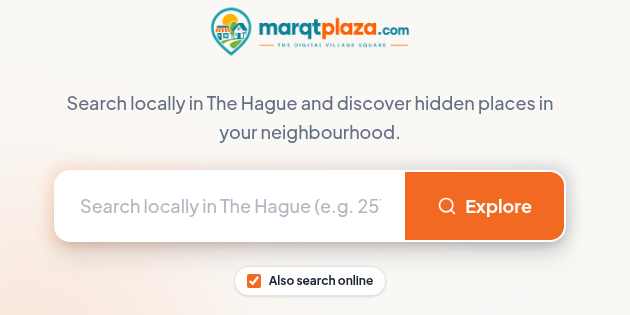

# BR-10 — Clear result-to-action path

## Enhancement assessment

**Priority:** P1 — High

**Criticality:** High

**Complexity:** High

**Estimated effort:** 12–20 person-days (provisional)

This estimate covers the full existing implementation specification, not only copy: result status and summaries, practical filters and sorting, cards and progressive loading, trust fields, grouped sources, detail and outbound actions, favourites detours, canonical sharing/history, responsive accessibility, localization, and acceptance testing. Risk is high because invented or ambiguous fields and actions can misdirect consumers; complexity is high because many result states, data-dependent actions, and guest/account transitions must work consistently without map dependence.

**Work packages**

- Result hierarchy, filter, and action UX design: **2–4 person-days**
- Result list, cards, filters, and detail implementation: **4–6 person-days**
- Action, state, URL, and contract integration: **3–5 person-days**
- Responsive, accessibility, localization, and state QA: **3–5 person-days**

**Estimation basis and exclusions:** The range excludes global rollout or dataset acquisition, ongoing verification operations, and third-party or legal lead times. Existing core search, authentication, and data contracts are presumed reusable; if they are absent or materially incompatible, re-estimate. Person-days are combined design, engineering, and QA effort, not elapsed delivery time, and overlap across BRs must not be summed blindly. [Assessment definitions and estimation basis](./requirements.md#assessment-definitions-and-estimation-basis)

## Status and interpretation

This is a proposed implementation specification, not implemented or verified behavior.
The live consumer application, source stack, result schema, APIs, analytics, and provider integrations must be inspected during implementation.
The workspace report viewer and weekend guide are not the live consumer application.
Proposed contracts below must be reconciled with existing contracts before development.

## Exact business requirement

> Discovery must provide practical filters, useful result cards, and explicit next actions to help consumers move from results to action.

## Objective

Enable a consumer to refine a Hague discovery need, compare results, understand source and freshness, and take an explicit next step.
Make the list the dependable primary results surface, independent of map permission and map SDK availability.
Keep local and opted-in web results distinguishable through source groups.
Provide accurate field-level source/date/status information and render unavailable facts as **Unknown**.
Avoid unsupported verification badges, allergy-safety guarantees, or certainty that the available evidence cannot support.

## Scope

- Search-results status, query summary, sort, practical filters, result cards, pagination or progressive loading, and empty/error states.
- Result-detail transition and actions such as view details, visit source/site, directions, contact, share, and account-backed favourite when supported by real data.
- Source-group presentation for explicit **Include web results** scope.
- Canonical, shareable search URLs and history behavior.
- Trust fields required for deciding whether to act.
- Mobile and desktop behavior, keyboard support, and Dutch-English parity.
- Current Hague-only availability and neighbourhood context.

## Non-goals

- Guaranteeing opening hours, availability, accessibility, allergy safety, or merchant identity without supporting evidence.
- Inventing contact links, routes, prices, ratings, source records, or verification states.
- Requiring map use or geolocation to see or act on a result.
- Automatically widening a local search to the web.
- Completing third-party purchases, bookings, or communications inside MarqtPlaza unless separately approved.
- Supporting cities beyond current Hague-only availability.
- Defining the final API path before the live stack is inspected.

## Current-state evidence

*Figure 1. CURRENT desktop baseline captured 18 September 2026. It is not a target design and is not evidence of mobile, authentication, result, keyboard, or network behavior.*

*Figure 2. CURRENT desktop crop captured 18 September 2026: logo, headline, query input, Explore action, and checked “Also search online.” It is not evidence that results, filters, grouping, or fresh-session defaults currently behave as specified below.*

### Precise observation

The capture visibly provides a query input, an **Explore** action, and a checked **Also search online** control.
It also shows Hague context and a map area whose actual instruction is **“Select a neighborhood directly on the map.”**
The image does not show a submitted result list, result card, filter set, detail view, action outcome, loading state, or error.
It cannot establish whether the checked scope is persisted, a fresh-session default, or backed by a particular contract.
Therefore, the local-only fresh-session default, explicit opt-in, source grouping, filters, and actions in this specification are target behavior only.

## Target screens

1. **Discovery entry:** query, city/neighbourhood/category controls, local-only scope, and explicit **Include web results** opt-in.
2. **List results:** criteria summary, total/status, sort, filters, source groups, result cards, and map opt-in.
3. **Filter surface:** practical controls based on actually available fields, with apply, clear, and cancel.
4. **Result detail:** identity, category, location, actionable data, trust metadata, source links, and caveats.
5. **Action handoff:** confirmation before leaving MarqtPlaza when necessary and safe external-link behavior.
6. **Share state:** canonical URL containing only public validated criteria.
7. **Guest favourite prompt:** account value and context-preserving sign-in/cancel.
8. **Empty/error state:** criteria explanation and non-destructive recovery.

## Result information hierarchy

Each result card must show only fields supplied by reconciled contracts.
The proposed minimum is name/title, category, neighbourhood, short factual description, and primary detail action.
When present, actionable fields may include current opening status, address, phone, official website/source, directions destination, or event date.
Each sensitive or freshness-dependent field must expose its own source, checked-on date, and status where the data model supports it.
Missing values must be displayed as **Unknown** when relevant to the decision, not omitted in a way that implies confirmation.
Source groups must clearly separate MarqtPlaza/local results from opted-in web results.
Cards must not display a generic “verified” badge unless an approved, field-specific verification definition and evidence exist.
Food/allergy information must use caveats and source attribution and never claim guaranteed safety.

## Interaction flows

### Flow 1 — Search to list

1. **Entry:** A fresh-session consumer sees local-only scope and current Hague-only availability.
2. **Action:** Consumer enters a query and optional neighbourhood/category, then submits.
3. **UI response:** A labeled loading state retains visible criteria and prevents duplicate submissions without disabling navigation.
4. **Success:** Focus moves to or is announced at the results status; local results render as a list.
5. **Persisted state:** City, neighbourhood, query, category, filters, scope, and locale enter the validated canonical URL.
6. **Back:** Back restores the preceding criteria and meaningful scroll position.
7. **Retry:** A failed search keeps all criteria and offers Retry.

### Flow 2 — Opt into web results

1. **Entry:** Consumer is on entry or results with local-only scope.
2. **Action:** Consumer activates **Include web results** after reading its scope explanation.
3. **UI response:** The active scope becomes explicit before or as the search reruns.
4. **Success:** Local and web results appear in visibly and programmatically named source groups.
5. **Persisted state:** Public `scope` is encoded in the canonical URL.
6. **Cancel/change:** Turning the option off returns to local-only results without clearing other criteria.
7. **Error:** A web-source error does not disguise available local results; partial status identifies the affected group.

### Flow 3 — Apply practical filters

1. **Entry:** Consumer opens **Filters** from a result list.
2. **Action:** Consumer selects available criteria such as category, neighbourhood, open/status timing, accessibility feature, or date only when backed by actual fields.
3. **UI response:** Applied count and changed values are perceivable; unavailable options are not fabricated.
4. **Apply:** Results update and a criteria summary exposes removable filter chips or equivalent controls.
5. **Cancel:** Unapplied changes are discarded; focus returns to Filters.
6. **Clear:** Clear filters preserves query, locale, city, and search scope unless explicitly stated otherwise.
7. **Empty:** No-match state identifies filters and provides targeted removal actions.

### Flow 4 — Card to detail and external action

1. **Entry:** Consumer reviews a semantic result card.
2. **Action:** Consumer activates **View details** or the card’s single defined primary link.
3. **UI response:** Detail opens with heading focus/announcement and retains originating list state.
4. **Action:** Consumer chooses a supported next action: directions, visit website/source, call, share, or favourite.
5. **External handoff:** Link destination and external behavior are clear; unsafe or malformed URLs are not rendered.
6. **Back:** Returning restores list criteria and context.
7. **Unavailable field:** The interface states **Unknown** and does not offer a dead action.

### Flow 5 — Directions without mandatory map

1. **Entry:** A result has a valid public address or destination accepted by the inspected integration.
2. **Action:** Consumer selects **Get directions**.
3. **UI response:** A safe handoff uses destination data, not private current coordinates unless separately chosen.
4. **Cancel/back:** Consumer returns to the same detail or list context.
5. **Failure:** If no valid destination exists, the action is absent and the location value is Unknown.
6. **Alternative:** The list/detail remains fully useful if the embedded map never loads.

### Flow 6 — Favourite from a guest session

1. **Entry:** Guest selects **Save to favourites**.
2. **UI response:** Prompt states favourites are account-backed and explains the consumer benefit.
3. **Cancel:** Prompt closes and returns to the exact result context; guest browsing continues.
4. **Sign in:** Authentication begins with a safe return target.
5. **Success:** The favourite is saved only after account association is confirmed, and context is restored.
6. **Error:** Save failure is announced and retryable; UI does not falsely show a saved state.

### Flow 7 — Share and restore

1. **Entry:** Consumer has applied criteria or opened a public result.
2. **Action:** Consumer activates Share/copies the canonical URL.
3. **Persisted state:** Search URL includes validated city, neighbourhood, query, category, filters, scope, and locale.
4. **Excluded state:** Coordinates, private preferences, tokens, and account identifiers are absent.
5. **Success:** A separate fresh session reproduces the public criteria.
6. **Invalid URL:** Unsupported values are safely rejected or normalized with an understandable state.

## Desired and undesired behavior

| Area | Desired behavior | Undesired behavior |
|---|---|---|
| Default scope | Fresh session is local-only | Checked web scope assumed without explicit choice |
| Web scope | Opt-in explained and results source-grouped | Local and web entries silently blended |
| Cards | Concise facts, trust metadata, primary action | Decorative cards with no clear next step |
| Missing data | Relevant field says Unknown | Blank space implying confirmed absence/presence |
| Trust | Field-level source/date/status/caveat | Unsupported universal verification badge |
| Safety | Evidence-bound wording | Allergy or accessibility guarantee without proof |
| Filters | Practical, contract-backed, reversible | Filters for nonexistent or unreliable fields |
| Map | Optional explicit Show map action | Map permission/SDK blocks list discovery |
| Action | Valid, labeled, safe handoff | Dead control or invented destination |
| Favourite | Account-backed with preserved guest context | Guest browsing blocked or fake local save |
| URL/history | Validated shared criteria and restorable Back | Sensitive data in URL or criteria reset |
| Geography | Hague-only availability clear | Unsupported city results implied |

## Required state behavior

### Initial

- Show local-only as the fresh-session default.
- Explain **Include web results** before opt-in.
- Provide manual neighbourhood and category discovery without map/location.
- Do not render filter values until their availability is confirmed by real data/contracts.

### Loading

- Retain criteria and existing results when appropriate.
- Announce progress without stealing focus repeatedly.
- Prevent stale responses from replacing a newer query.
- Do not load map resources unless **Show map** was activated.

### Success

- Announce result status and identify source groups.
- Render stable cards with explicit primary actions.
- Show field-level source/date/status and unknown values according to BR-07.
- Update URL/history without leaking private state.

### Empty

- State that no result matched the displayed criteria.
- Offer targeted filter removal, neighbourhood change, or explicit web-results opt-in.
- Do not silently expand geography or scope.

### Error and partial error

- Retain query and applied filters.
- Distinguish total failure from one source-group failure.
- Provide Retry and leave successful local results actionable.
- Sanitize external error content before display.

### Permission denied

- Search and list actions continue without geolocation or map permission.
- Manual neighbourhood selection remains available.
- Directions use public destination data and do not require current position.

### Guest and account

- Guests can search, filter, open details, follow public actions, and share.
- Favourites require an account and are not represented as persisted until confirmed.
- Sign-in success, cancellation, and error all preserve discovery context.

## Technical implementation plan

### Discovery

1. Inspect live routes, components, API clients, source models, field provenance, authentication, and outbound-link handling.
2. Audit which filters and actions are backed by real, sufficiently reliable fields.
3. Document current pagination, caching, deduplication, URL, and history behavior before changing it.

### Frontend

4. Build semantic result status, source-group headings, list, cards, filter summary, and empty/error components.
5. Keep one unambiguous primary card action; make secondary actions labeled controls.
6. Avoid clickable-card nesting conflicts and support keyboard activation.
7. Preserve list state and focus across details, dialogs, external handoffs, and Back.
8. Use progressive disclosure for provenance and caveats without hiding decision-critical status.
9. Lazy-load map code only after explicit **Show map** and retain list fallback.
10. Implement responsive single-column cards and touch targets under BR-09.

### Proposed data contract

11. Reconcile existing schemas before adopting this proposed result shape.
12. Proposed `DiscoveryResult`: `id`, `title`, `category`, `city`, `neighbourhood`, `summary`, `actions`, `fields`, `sourceGroup`, and `detailUrl`.
13. Proposed field metadata: `value`, `status`, `sourceName`, `sourceUrl`, `checkedOn`, and `caveat`; unknown is explicit.
14. Proposed action: `type`, `labelKey`, `url` or safe destination identifier, and availability reason.
15. Proposed response: validated criteria, groups, items, paging cursor, partial errors, and generated-at metadata.
16. If a new route is needed, a proposed `GET /api/discovery` accepts public criteria; the final path must match the inspected stack.
17. Validate enums, lengths, locale, city, filters, cursor, and URLs at trust boundaries.
18. Do not derive unsupported “verified,” allergy-safe, or current-open claims.

### Integration and privacy

19. Normalize/deduplicate only with documented rules and retain source distinctions.
20. Allow local results to succeed when an opted-in web provider fails.
21. Use allowlisted outbound schemes and safe `rel` behavior for new tabs.
22. Exclude coordinates, tokens, account IDs, and private preferences from canonical URLs and public telemetry.
23. Bind favourite writes to authenticated accounts and protect return URLs against open redirects.

### Accessibility and localization

24. Target WCAG 2.2 AA for headings, landmarks, focus, labels, status announcements, contrast, reflow, and target size.
25. Ensure source groups and field status are not color-only.
26. Add all strings simultaneously in Dutch and English, including errors, Unknown, caveats, filters, and actions.
27. Use locale-consistent **Den Haag** and **The Hague** while preserving canonical geography identifiers internally.

### Rollout

28. Feature-flag new result cards/filters if supported by the live stack.
29. Validate relevance and action integrity on a controlled Hague dataset without fabricating content.
30. Monitor privacy-approved aggregate search success, empty/error rate, filter use, and action starts; define thresholds during implementation.
31. Roll back new rendering without changing canonical public URLs.

## Dependencies

- **BR-01:** result journey must reinforce product purpose.
- **BR-02:** filters, result groups, and actions need clear labels/hierarchy.
- **BR-03:** list discovery is independent of map permission and SDK.
- **BR-04:** local-only default, web opt-in, and source grouping.
- **BR-05:** Hague neighbourhood/category context.
- **BR-06:** accessible cards, filters, focus, and alternatives.
- **BR-07:** source/date/status, caveats, and explicit unknowns.
- **BR-08:** scope, geolocation, retention, sharing, and deletion rules.
- **BR-09:** mobile-first card/filter/action presentation.
- **BR-11:** account-backed favourites and preserved guest context.
- **BR-12:** Dutch-English parity and consistent geography.

## Acceptance criteria

1. **BR-10-AC-01:** A fresh session defaults to local-only and does not include web results until explicit opt-in.
2. **BR-10-AC-02:** Opted-in local and web results have visible and programmatic source-group labels, including partial-error status.
3. **BR-10-AC-03:** Consumers can search, filter, open a detail, and start a valid public action without map permission or map SDK.
4. **BR-10-AC-04:** Every rendered card has an explicit primary action and no action is rendered without valid backing data.
5. **BR-10-AC-05:** Decision-relevant fields show field-level source/date/status/caveat or explicitly Unknown.
6. **BR-10-AC-06:** No unsupported verification badge, allergy-safety guarantee, or unsupported current-state claim is displayed.
7. **BR-10-AC-07:** Apply, clear, cancel, empty, and retry paths preserve the documented criteria.
8. **BR-10-AC-08:** Canonical search URLs round-trip validated public criteria and exclude coordinates, private preferences, tokens, and account identifiers.
9. **BR-10-AC-09:** Back/Forward and sign-in cancel/success restore the originating result context.
10. **BR-10-AC-10:** Guests retain discovery and public actions; favourites persist only after confirmed account-backed save.
11. **BR-10-AC-11:** Cards, filters, groups, statuses, and actions meet the WCAG 2.2 AA target for supported interactions.
12. **BR-10-AC-12:** All result-to-action copy and states have Dutch-English parity and locale-consistent Hague terminology.
13. **BR-10-AC-13:** Empty/error states never silently broaden search scope or geography.
14. **BR-10-AC-14:** The result experience clearly states current Hague-only availability.

## Test cases

| Test ID | AC mapping | Preconditions | Steps | Expected result | Level |
|---|---|---|---|---|---|
| BR-10-TC-01 | AC-01, AC-03 | Fresh guest session | Submit local search, open detail/action | Local list journey works; no map/web dependency | E2E |
| BR-10-TC-02 | AC-01, AC-02 | Web option available | Opt in and search with one source failing | Groups remain distinct; partial error names failed group | Integration |
| BR-10-TC-03 | AC-04, AC-05 | Mixed complete/unknown fields | Inspect cards and details | Valid actions only; unknown and provenance explicit | Component/integration |
| BR-10-TC-04 | AC-06 | Records with unconfirmed sensitive claims | Render results | No badge/guarantee; approved caveat and source shown | Content/security |
| BR-10-TC-05 | AC-07, AC-13 | Filters that produce zero results | Apply, clear, cancel, retry failure | Criteria behave predictably; no silent broadening | E2E/negative |
| BR-10-TC-06 | AC-08 | All public criteria selected | Share and open URL in fresh session | Criteria restore; prohibited fields absent | Integration/security |
| BR-10-TC-07 | AC-09 | Scrolled filtered list | Open detail, Back; start and cancel sign-in | List criteria/context restore | E2E |
| BR-10-TC-08 | AC-10 | Guest and account test users | Save, cancel, authenticate, retry failed save | Guest stays browsing; only confirmed account save appears | E2E |
| BR-10-TC-09 | AC-11 | Keyboard and screen reader | Operate filters, groups, cards, actions | Names/order/status/focus are perceivable and operable | Accessibility |
| BR-10-TC-10 | AC-11 | 320px and 400% zoom | Complete search-to-action | No clipped controls or two-dimensional page scroll | Accessibility/mobile |
| BR-10-TC-11 | AC-12, AC-14 | NL/EN locales | Exercise all states | Complete translations and correct Hague term/coverage | Localization |
| BR-10-TC-12 | AC-03 | Map provider blocked and location denied | Search, filter, act from list | Core journey succeeds unchanged | E2E/negative |
| BR-10-TC-13 | AC-04, AC-08 | Malformed action and URL parameters | Open result/shared URL | Unsafe values rejected; no dead or unsafe link | Security |
| BR-10-TC-14 | AC-07 | Slow overlapping requests | Submit query A then B | Stale A does not replace current B | Integration |

## Future screenshot capture matrix

These are future implementation captures, not evidence of completed behavior.

| Capture ID | Viewport/state | Required evidence |
|---|---|---|
| BR-10-SS-01 | Desktop, local results EN | Criteria, filters, local group, useful cards, actions |
| BR-10-SS-02 | Desktop, web opt-in EN | Explicit scope and separated local/web groups |
| BR-10-SS-03 | Mobile, result list NL | Reflowed cards, filters, next actions |
| BR-10-SS-04 | Mobile, filters open | Apply, clear, cancel, focus indication |
| BR-10-SS-05 | Desktop, result detail | Field-level source/date/status and Unknown |
| BR-10-SS-06 | Mobile, empty | Criteria summary and targeted recovery |
| BR-10-SS-07 | Mobile, partial error | Successful local group and failed-source retry |
| BR-10-SS-08 | Mobile, guest favourite prompt | Account value and context-preserving cancel |
| BR-10-SS-09 | Desktop, map not loaded | Complete list actions plus explicit Show map |
| BR-10-SS-10 | Mobile, 400% zoom | Operable card/action hierarchy |

Record build, date, browser, OS, viewport, locale, criteria, source scope, and test-data provenance; redact personal information.