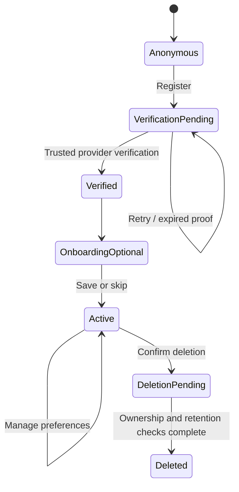
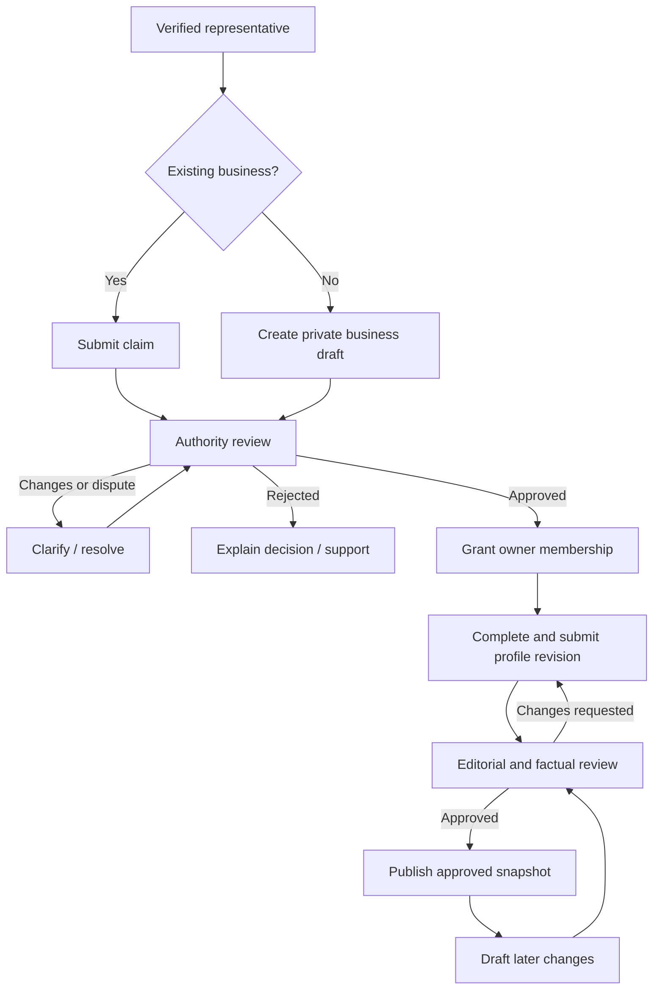

# MarqtPlaza — Detailed implementation plan

**Date:** 11 September 2026  
**Status:** Proposed implementation plan; not an implementation or release approval.  
**Scope:** Consumer and business onboarding/registration, with dependencies on the supplied discovery enhancement backlog.  
**Delivery boundary:** Documentation only. Campaign interviews remain paused and unvalidated.

## 1. Objective and definition of success

Allow a consumer to create a verified account, optionally set preferences, and return to a useful action. Allow an authorized business representative to register, claim or submit a business, complete a profile, and obtain a review decision.

Deliver complete journeys, including API enforcement, persistent state, real messages, error recovery, accessibility, and account management. A screen without working persistence, or an API without its user interface, is not complete.

Success means:

- Anonymous discovery remains available without forced registration.
- Guide subscription and consumer account creation are distinct choices.
- Contact verification does not imply business authority or factual verification.
- Business data is accessible only to authorized members and reviewers.
- Optional preferences and marketing consent can be skipped and later changed.
- Business drafts survive interruptions, and review decisions are visible with actionable next steps.
- Existing campaign registration and management remain compatible.
- Release gates in section 13 pass before enabling the new flows publicly.

## 2. Current-state baseline

Repository inspection found the following; these are structural/code observations, not runtime test results.

| Area | Existing implementation | Gap for this plan |
|---|---|---|
| Consumer frontend | `artifacts/marqtplaza-weekend-guide/src/App.tsx`; landing, confirm, confirmation-retry, preferences, unsubscribe, deletion, support, privacy pages | No general account, authenticated consumer profile, or business workspace |
| Consumer service lifecycle | Campaign registration, double opt-in, preference management, unsubscribe, deletion requests, support | A campaign subscriber is not an authenticated product user |
| API | Express routes in `artifacts/api-server/src/routes/campaign.ts`; mounted through `src/routes/index.ts` and `src/app.ts` | No authenticated account/business/review APIs |
| Campaign identity | Hashed confirmation and management tokens; frontend helper `src/lib/management-token.ts` | These tokens must not become general account credentials |
| Database | `lib/db/src/schema/campaign.ts`, exported by `lib/db/src/schema/index.ts` | No users, businesses, memberships, listings, claims, or reviews |
| Contracts | `lib/api-spec/openapi.yaml`; Orval-generated React Query client and Zod schemas | New contracts required before implementing new client flows |
| Messages | `artifacts/api-server/src/lib/campaign-email.ts` | Verify real delivery configuration; add account/business lifecycle delivery without assuming campaign delivery is production-ready |
| Publication safeguards | Campaign production writes depend on configured legal/operator details and email readiness | Preserve campaign gates; introduce independently evaluated account/business readiness |
| Quality commands | Workspace typecheck/build and API code generation exist | No dedicated automated journey test suite was identified |

### Architecture constraints

- Keep React/Vite, Wouter, React Query, Express, PostgreSQL/Drizzle, and the existing pnpm workspace.
- Use the existing web artifact for this same-product extension. Reassess only if the owner explicitly requests a standalone business application.
- Preserve the existing campaign paths and behaviour. Additive account/business routes must not repurpose `/preferences` or other campaign management routes.
- UI routes are relative to the artifact base `/weekend-guide/`; use the existing base-path approach. API routes use the project's `/api` service route. Do not hardcode localhost or escape the preview base.
- Edit OpenAPI source, then regenerate clients and validators; do not hand-edit generated files.
- New database changes must be additive and migration-reviewed. Do not replace the existing database.
- Select and configure authentication before implementing identity-dependent functionality. Use the platform's current authentication setup guidance at implementation time; do not build a custom password store.

## 3. Supplied enhancement backlog

These are enhancement IDs, not project-task references. Values and spelling are preserved. Empty cells mean **not assessed**, not zero. The older `doc/enhancement-requirements.md` uses a different numbering scheme.

| Number | Title | State | Priority (MN) | Priority (RH) | Value (RH) | Complexity |
|---|---|---|---|---|---|---|
| 1 | Verified, Fresh Listing Facts | inrefinement | high | high | 5 | 1 |
| 11 | Transparent, Actionable Deals | inrefinement | high | high | 5 | 1 |
| 2 | Open Now and Reachable Nearby | inrefinement | medium | high | 5 | 1 |
| 3 | Intent-Aware Local Search | inrefinement | medium | med | 4 | 3 |
| 4 | Accessible and Sensory Discovery | inrefinement | medium | low | 4 | 1 |
| 5 | Dietary, Allergy, and Lifestyle Filters | inrefinement | medium | high | 4 | 2 |
| 6 | Trustworthy Community Context | inrefinement | medium | low | 3 | 3 |
| 7 | Today and This Weekend Planner | inrefinement | medium | high | 4 | 1 |
| 8 | Map-Based Practical Discovery | inrefinement | medium | med | 3 | 3 |
| 10 | Clear Price and Value Context | inrefinement | medium | med | 3 | 3 |
| 15 | Family Planning Mode | inrefinement | medium | high | 4 | 4 |
| 16 | Compare Shortlisted Places | inrefinement | medium | low | 3.5 | 3 |
| 17 | Weather-Aware Alternatives | inrefinement | low | low | 4.5 | 3 |
| 18 | Follow Neighbourhoods and Interests | inrefinement | medium | | 4 | 2 |
| 23 | Community Questions and Local Answers | inrefinement | medium | | 4 | 2 |
| 24 | Privacy-First Preference Controls | inrefinement | medium | | 4 | 3 |
| 25 | Accessible Low-Data Discovery Experience | inrefinement | medium | | 3 | |
| 9 | Save, Share, and Collaborate on Lists | inrefinement | low | medium | 5 | 3 |
| 12 | Direct Booking and Availability Handoffs | inrefinement | low | high | 5 | 5 |
| 13 | Neighbourhood Guides and Profiles | inrefinement | low | high | 5 | 2 |
| 14 | Dutch-English Listing Parity | inrefinement | low | | 5 | 1 |
| 19 | Personalized For You Feed | inrefinement | low | med | 5 | 3 |
| 20 | Route-Aware Local Itineraries | inrefinement | low | med | 4 | 2 |
| 21 | Explain Why Results Are Recommended | inrefinement | low | low | 2 | 2 |
| 22 | New, Changed, and Closing Soon Updates | inrefinement | low | high | 2 | 1 |

Proposed additions, pending owner approval:

| Working label | Permanent ID | State | Priorities/value/complexity |
|---|---|---|---|
| Consumer account and onboarding | TBD | Proposed | TBD |
| Business registration, claims, and onboarding | TBD | Proposed | TBD |

Do not infer a single approved ordering from conflicting MN/RH priorities. Dependency ordering below is a technical proposal, not a change to either person's rankings.

## 4. Recommended MVP and boundaries

### Include

- Anonymous access; verified consumer/representative identity; recovery and sign-out.
- One person may use consumer features and represent a business without a second identity.
- Optional language, neighbourhood, and interest setup using controlled choices.
- A visible saved-preference summary as the first useful account outcome; no fictitious personalized feed.
- Business lookup, claim or new submission, private draft, manual authority review, editorial review, and a basic public approved profile.
- Owner membership and platform reviewer permissions, with clear separation.
- Consumer account settings and business status/dashboard.
- Lifecycle notifications, audit records, safe retries, deletion/request handling.

### Defer

- Paid plans, checkout, billing, campaign purchasing, booking inventory, and native booking.
- Team invitation UI, self-service ownership transfer, and bulk multi-business management.
- Personalized recommendation algorithms, collaborative lists, social/community posting, route planning, and map search.
- Uploaded identity documents: use minimally necessary reference evidence and a separately approved secure verification route if stronger evidence is needed.
- Automated business verification and automated publication approval.

Model memberships so later team support does not require a destructive redesign. MVP UI supports an owner and a manual support-assisted transfer process; do not advertise deferred capabilities.

## 5. Consumer flow

### Proposed UI routes

`/account/register`, `/account/sign-in`, `/account/verify`, `/account/onboarding`, `/account`, `/account/preferences`, `/account/privacy`. Authentication provider routes may replace the verification/sign-in internals after provider selection. All paths are relative to the web artifact.

| Step | Screen/action | Data and validation | State/system behaviour | Permission and acceptance |
|---|---|---|---|---|
| C1 | Browse existing guide | No account data | Anonymous; register only for an account-specific action | Public content remains accessible |
| C2 | Register/sign in | Provider-managed email/contact; locale; applicable terms version. Do not request birth date, nationality, precise location, or phone by default | Explain account versus guide subscription; preserve allowlisted relative return path | Existing account receives a safe sign-in/recovery route without public email enumeration |
| C3 | Verify contact | Provider-managed proof, expiry and retry controls | Verification pending → verified; expired/reused links show a recoverable state | API derives verification from trusted provider claims, never a browser boolean |
| C4 | Optional setup | Locale `nl/en`; optional controlled neighbourhood/interest IDs | Save or skip; persist onboarding completion independently of whether preferences exist | Refresh/resume retains choices; skipped fields remain unset, not inferred |
| C5 | Finish | No new required data | Return to intended supported action or account preference summary | No repeated registration prompt or open redirect |
| C6 | Optional guide subscription | Explicit separate choice; existing service consent and confirmation rules | Start existing campaign opt-in deliberately; never subscribe implicitly | Account creation alone cannot set campaign service/marketing consent |
| C7 | Settings | Versioned updates to preferences and optional consent | Save confirmed by server; failures preserve draft input | Only current user can read/write own private preferences |
| C8 | Recovery/sign-out | Provider-managed recovery; reauthentication for sensitive changes | Session invalidation and contact-change verification | Recovery does not create a duplicate local user |
| C9 | Privacy controls | Explicit action: marketing withdrawal, guide unsubscribe, account deletion | Explain scope and consequences before confirmation | Account deletion cannot silently orphan sole-owned businesses; show ownership resolution path |



Session state, account status, campaign service consent, and marketing consent are independent. Signing out does not delete an account; guide unsubscribe does not delete an account; account deletion must explain its effect on separately requested services.

## 6. Business flow

### Proposed UI routes

`/business`, `/business/start`, `/business/lookup`, `/business/claims/:claimId`, `/business/:businessId/onboarding`, `/business/:businessId`, `/business/:businessId/profile`, `/review/businesses`, `/review/businesses/:businessId`.

| Step | Screen/action | Data and validation | State/system behaviour | Permission and acceptance |
|---|---|---|---|---|
| B1 | Business introduction | No data | Explain scope, review, and no guaranteed visibility/sales | Public; no payment implied |
| B2 | Representative register/sign in | Shared identity flow; verified contact | Reuse existing identity if also a consumer | Unverified users cannot claim or submit |
| B3 | Find business | Business name and broad locality; optional website | Return limited public matches only; show claim/new options | No private owner/contact information is disclosed |
| B4 | Claim existing business | Business ID, role/authority declaration, minimal source/reference evidence | Pending claim; representative gets access to own claim, not existing private business data | Duplicate/open claims handled transactionally; conflicts sent to reviewer |
| B5 | New business draft | Public name, category, neighbourhood/location appropriate to listing, representative authority declaration | Draft + pending authority review; duplicate candidates checked again on submission | Draft is private to creator and reviewers; not a public business |
| B6 | Establish authority | Reviewer checks appropriate business-controlled contact/source; records reason and evidence reference | Pending → approved / changes requested / rejected / disputed | Verification of email alone cannot approve authority; ownership grant is atomic with approval |
| B7 | Complete profile | Required public name/category/location, description, source URL; optional public contact, hours, access details; NL/EN content | Save draft/resume; unknown facts remain unknown; structured schedules distinguish closed/unknown | Owner edits authorized draft; no HTML/script or arbitrary URL protocols |
| B8 | Submit for editorial review | Required fields and bilingual completeness; revision/version | Immutable submitted snapshot; pending editorial review | Owner cannot set publication or checked-on status |
| B9 | Reviewer decision | Decision, reasons, fact-source checks, checked-on/expiry metadata | Approved / changes requested / rejected | Platform reviewer only; reason visible to owner without internal/private evidence exposure |
| B10 | Publication/dashboard | Approved snapshot and status | Explicit publish action after authority + editorial gates; show source/check dates | Public endpoint serves published approved fields only |
| B11 | Edit/resubmit | New draft revision and expected version | Existing approved version stays live unless unsafe/stale; new revision re-enters review | Concurrent updates return conflict; stale review cannot publish an overwritten revision |
| B12 | Closure/suspension/removal | Reason and desired action | Unpublish independently of membership/account deletion; notify owner | Reviewer suspension blocks mutations; support-assisted transfer rechecks authority |

### Independent state dimensions

| Dimension | Proposed states |
|---|---|
| Representative account | pending verification, active, suspended, deletion pending, deleted |
| Claim | draft, submitted, reviewing, changes requested, approved, rejected, disputed, withdrawn |
| Membership | active, suspended, revoked |
| Profile revision | draft, submitted, reviewing, changes requested, approved, rejected |
| Publication | unpublished, published, suspended, archived |
| Fact freshness | unchecked, checked, stale, disputed |



## 7. Data model and migration design

The following tables/modules are proposed, not existing. Final names can follow repository conventions.

| Entity | Key fields/constraints | Privacy and lifecycle |
|---|---|---|
| `users` | UUID; unique auth-provider subject; status; locale; onboarding completion; timestamps | Provider subject is identity key, not mutable email. Store email locally only if operationally necessary |
| `consumer_preferences` | User FK; controlled neighbourhood/interest associations; revision | No inferred preferences or sensitive categories by default |
| `account_consent_events` | User FK; purpose; grant/withdrawal; notice version; timestamp; source | Append-only consent history with approved retention; separate from operational event analytics |
| `businesses` | UUID; public identity fields; publication status; approved revision pointer | Do not expose draft/private contact data through public serialization |
| `business_memberships` | Business/user FK; role; status; unique business-user pair | Server-authoritative access; indexes on user/business/status |
| `business_claims` | Business/creator FK; status; evidence reference; decision reason; reviewer; version | Restricted evidence; retain only what is necessary; conflicting claim policy enforced transactionally |
| `business_profile_revisions` | Business FK; version; NL/EN fields; structured factual data; review status | Submitted revision immutable; public snapshot references approved revision |
| `business_reviews` | Claim or revision target; reviewer; decision; reason; timestamps | Durable audit without full sensitive document copies |
| `fact_checks` | Business/revision field or item; source URL; checked-on; reviewer; expiry/status | Source and freshness separate from ownership approval |
| `lifecycle_outbox` | Event ID; recipient reference; template; locale; status; attempts; next retry; provider ID | No plaintext verification tokens in ordinary logs; bounded retries and restricted payload retention |
| `account_requests` | User/business scope; request type; status; deadline; resolution | Support deletion/transfer requests and accountable fulfilment |

### Migration rules

1. Inventory existing development and production schema safely; do not query private data unnecessarily.
2. Introduce new tables/indexes with reviewed migrations. Preserve all campaign records and existing endpoints.
3. Provision users idempotently from trusted auth identity. Never elevate roles using client-submitted data.
4. Do not backfill accounts for campaign subscribers. If explicit linking is later offered, require authenticated verified control and a scoped linking operation; preserve existing consent events.
5. Establish foreign keys and delete/anonymize behaviours deliberately. A sole owner needs transfer/closure resolution before account deletion completes.
6. Rehearse migration and rollback on non-production data. Avoid blind schema push as a production migration strategy.
7. Rollback disables new entry points first; do not drop tables containing user submissions.

## 8. API and authorization contract

Proposed endpoints below are relative to `/api`. Authentication-provider verification/recovery endpoints should remain provider-managed rather than being duplicated.

| Endpoint | Access | Responsibility |
|---|---|---|
| `GET /account/me` | Authenticated | Safe user summary, capabilities, onboarding status |
| `PATCH /account/preferences` | Active current user | Validate controlled options; optimistic version update |
| `POST /account/onboarding/complete` | Verified current user | Idempotent save/skip completion |
| `POST /account/consents` | Current user | Explicit purpose-specific grant/withdrawal |
| `POST /account/deletion-requests` | Reauthenticated user | Show/confirm scope; create tracked request |
| `GET /businesses/lookup` | Verified user for claim workflow | Bounded public-only matching, throttled |
| `POST /businesses` | Verified user | Idempotent private draft creation |
| `POST /businesses/:id/claims` | Verified user | Create claim without granting business access |
| `GET /business-claims/:id` | Claim creator or reviewer | Claim status and allowed next actions |
| `PATCH /business-claims/:id` | Claim creator in editable state | Update evidence reference; version required |
| `POST /business-claims/:id/submit` | Claim creator | Validate and queue authority review |
| `POST /business-claims/:id/withdraw` | Claim creator | Withdraw pending claim without erasing audit |
| `GET /account/businesses` | Current user | Authorized memberships and own pending drafts/claims |
| `GET/PATCH /businesses/:id/profile` | Authorized owner; reviewer read | Read/write draft; conditional version updates |
| `POST /businesses/:id/profile/submit` | Authorized owner | Freeze revision and queue editorial review |
| `POST /businesses/:id/unpublish` | Owner or reviewer by policy | Unpublish with reason; retain audit |
| `GET /review/businesses` | Platform reviewer | Paginated authority/editorial queues |
| `POST /review/claims/:id/decision` | Platform reviewer | Atomic state transition and membership grant |
| `POST /review/revisions/:id/decision` | Platform reviewer | Decide on exact submitted version |
| `POST /review/businesses/:id/publication` | Platform reviewer | Publish/suspend only after gates |
| `GET /public/businesses/:id` | Public | Published approved snapshot only |

Define missing support-assisted transfer and request-status operations during contract review; they must have a working support route before MVP release.

### Contract rules

- Standard error shape: stable code, safe localized message key, field errors where applicable, correlation ID.
- Define 401 unauthenticated, 403 forbidden, 404 unavailable/non-disclosing resource response, 409 duplicate/version/state conflict, 422 invalid input, 429 limited, 503 unavailable.
- Use idempotency keys for creation/submission and unique database constraints for final protection.
- Require expected revision/version for draft updates and review decisions.
- Derive actor ID and business permissions from authenticated server context on every request.
- Use bounded pagination and lookup limits. Reject unexpected fields to prevent mass assignment.
- Restrict redirects to allowlisted local paths. Validate URL protocols and output-escape submitted text.
- Configure credential/CORS, CSRF/origin protections, cookie/session policy, and proxy trust according to the chosen provider and deployment. Never rely on browser-only validation.

### Permission matrix

| Action | Anonymous | Verified consumer | Claimant | Business owner | Platform reviewer |
|---|---|---|---|---|---|
| Read published content | Yes | Yes | Yes | Yes | Yes |
| Manage own preferences | No | Own only | Own only | Own only | Own only |
| Create/read own claim | No | Yes | Own only | Own only | Review access |
| Read other business private records | No | No | No | No | Assigned operational access |
| Edit business draft | No | No | Own new draft only, before authority approval | Own business only | No silent edits; use recorded correction/review policy |
| Approve authority/facts | No | No | No | No | Yes, audited |
| Publish approved revision | No | No | No | No | Yes, after gates |

Reviewer privileges are provisioned outside public registration. Reviewers must not approve their own business/claim; assign a different reviewer or block the decision.

## 9. Messages, privacy, and accessibility

### Message lifecycle

| Trigger | Recipient | Content and next action |
|---|---|---|
| Registration/contact change/recovery | Account holder | Provider-managed verification/recovery; bounded expiry and safe resend |
| Business claim submitted | Claimant | Receipt and status link; no approval promise |
| Authority changes/rejection/approval | Claimant | Safe reason and next action; no competing claimant details |
| Profile submitted | Owner | Submission receipt and review status |
| Editorial decision/publication/suspension | Owner | Decision, changes needed, or public profile/status link |
| Deletion request/completion | Account holder | Scope, fulfilment status, exceptions and support route |

Use durable outbox delivery for application-owned messages. Commit business state and outbox event together; queue failure must not lose a successful submission. Distinguish queued, provider-accepted, delivered if reported, and failed. Retry with backoff and deduplicate by event/recipient/template. Escalate exhausted retries to operations and show safe resend/support options. Never show “delivered” based only on an API submission.

Real inbox delivery and confirmed operator/legal details are existing separate workstreams. Coordinate interfaces and release gates rather than duplicating those assignments.

### Privacy

- Present privacy information at collection; distinguish acknowledgment, contractual necessity, and optional consent. Legal basis requires owner/legal approval.
- Marketing starts unselected. Research invitations, guide service, and product marketing are separate purposes.
- Store neighbourhood preferences rather than precise live location by default.
- Do not persist health/disability/allergy characteristics during basic onboarding.
- Define numeric retention periods and deletion exceptions before release; do not invent legal retention periods.
- Account deletion includes provider identity, local preferences, memberships, and related operational data subject to documented retention. Explain separately requested campaign service consequences.
- Keep audit records minimal and restricted; log event codes and internal IDs, not emails, tokens, evidence content, or free-text form bodies.

### Accessibility and language

- Target WCAG 2.2 AA for changed journeys; automated scores are not a substitute for manual keyboard/screen-reader checks.
- Semantic labels, error summary and inline associations, predictable focus, status announcements, visible focus, adequate contrast, and usable target sizes.
- No mandatory map, animation, drag action, or image upload to complete registration.
- Render lightweight forms and progressive steps; retain input on retry and support slow connections.
- Dutch and English have equivalent required fields, notices, errors, messages, and decisions. Changing language retains form state.
- Ask for practical access information without requiring disclosure of a representative's or consumer's medical condition.

## 10. Enhancement dependency mapping

| Backlog item | Relationship | MVP boundary |
|---|---|---|
| #1 Verified, Fresh Listing Facts | Hard dependency for public business profile trust | Minimal source/check/expiry metadata and reviewer workflow; no broad catalog automation |
| #11 Transparent, Actionable Deals | Future business capability enabled by authority/membership | No deal publishing or purchase flow in onboarding MVP |
| #14 Dutch-English Listing Parity | Hard dependency for onboarding and published profile content | Equal-meaning UI/content; reviewer checks parity |
| #18 Follow Neighbourhoods and Interests | Consumer setup integration | Persist optional controlled choices; no push/notification promise without delivery implementation |
| #24 Privacy-First Preference Controls | Hard dependency | Consent/settings/deletion scope and working controls |
| #25 Accessible Low-Data Discovery Experience | Hard dependency | Apply to all new account/business/reviewer screens |
| #9 Save, Share, and Collaborate on Lists | Future account-gated action | Preserve generic safe return path; do not build collaboration |
| #19 Personalized For You Feed | Future preference consumer | No ranking algorithm or claim of personalized results yet |
| #13 Neighbourhood Guides and Profiles | Limited public-profile dependency | Minimal approved business profile; defer neighbourhood guide expansion |
| #2 / #7 / #22 | Future readers of hours, dates and freshness | Structure facts so future use is possible; no open-now, planner or updates engine |
| #4 / #5 | Optional factual profile fields with privacy constraints | Unknown access/dietary information remains unknown; no sensitive user profiling |
| #3 / #6 / #8 / #10 / #12 / #15 / #16 / #17 / #20 / #21 / #23 | Not onboarding prerequisites | Leave in discovery backlog; do not widen this delivery |

## 11. Dependency-ordered work packages

Estimates use a proposed relative 1–5 complexity scale, not elapsed-time commitments or replacements for supplied backlog scores. All file paths labelled “new” are planned locations.

### WP0 — Confirm scope and baseline

- **Outcome:** Approved MVP and a reproducible understanding of current campaign behaviour.
- **Work:** Check existing flows; decide provider, account/subscription separation, business authority evidence, reviewer owner, geographic scope, legal readiness, and deletion policy.
- **Files:** This plan; existing `doc/enhancement-requirements.md`; campaign documentation; current app/API/schema.
- **Dependencies:** Owner answers in section 14.
- **Acceptance:** Decision register signed off; baseline commands captured; existing route compatibility matrix recorded.
- **Complexity:** 1; decisions dominate effort.
- **Release risk:** Unresolved policy cannot be filled by fake defaults.

### WP1 — Identity, contract, and data foundations

- **Outcome:** Server can identify a verified person and enforce roles safely.
- **Work:** Configure provider using current supported setup; add trusted auth middleware and idempotent local provisioning; define OpenAPI schemas; additive migrations; reviewer provisioning; permission helpers.
- **Existing files:** `lib/api-spec/openapi.yaml`, `lib/db/src/schema/index.ts`, `artifacts/api-server/src/app.ts`, `src/routes/index.ts`.
- **New modules:** `lib/db/src/schema/accounts.ts`, `businesses.ts`; API `src/middleware/auth.ts`, `src/lib/permissions.ts`, `src/routes/accounts.ts`.
- **Dependencies:** WP0 and authentication configuration.
- **Acceptance:** Unauthenticated calls fail safely; fabricated IDs/roles cannot elevate access; repeat provisioning yields one user; existing campaign records unchanged.
- **Complexity:** 4; identity and authorization affect every subsequent path.
- **Rollback:** Disable new account entry points and retain additive tables; never reinterpret campaign tokens as sessions.

### WP2 — Consumer account journey

- **Outcome:** Register, verify, skip/save setup, return to a useful destination, and edit preferences.
- **Work:** Add account route group, account guard, forms, bilingual copy, preference summary, return-path allowlist, recovery/sign-out integration.
- **Existing files:** `artifacts/marqtplaza-weekend-guide/src/App.tsx`, `src/components/layout.tsx`, `src/lib/translations.ts`, generated client exports.
- **New modules:** `src/pages/account/*`, `src/components/account/*`; account API handlers and preference schema.
- **Dependencies:** WP1.
- **Acceptance:** C1–C8 work end to end; no implicit guide subscription; no loss of form intent after verification; skip creates no invented preference.
- **Complexity:** 3; multiple identity/return states and campaign separation.
- **Rollback:** Hide account entry points, preserve campaign routes and saved account data.

### WP3 — Business intake, claims, and durable drafts

- **Outcome:** Representative can find a business, submit a claim/new draft, and track progress.
- **Work:** Public-only lookup, duplicates/conflicts, claim records, private draft CRUD, source evidence references, version control, explicit submit/withdraw states.
- **New modules:** API `src/routes/businesses.ts`, `business-claims.ts`; web `src/pages/business/*`; shared business form components.
- **Dependencies:** WP1; common identity UI from WP2.
- **Acceptance:** B1–B7 persist across refresh; conflicting submissions cannot grant dual ownership; an existing-business claimant cannot read owner-private data; draft never appears publicly.
- **Complexity:** 4; duplicate resolution and authority-state permissions.
- **Rollback:** Disable new submissions; keep status/support available for existing claims.

### WP4 — Reviewer workflow and public profile

- **Outcome:** Reviewer can approve authority, request changes, approve an exact profile revision, and publish safely.
- **Work:** Paginated queues, detail/evidence view, recorded decisions, atomic owner grants, editorial/freshness fields, profile snapshot, suspension and unpublish controls.
- **New modules:** API `src/routes/business-review.ts`, `public-businesses.ts`; web `src/pages/review/*`, `src/pages/business/public-profile.tsx`.
- **Dependencies:** WP3; minimum #1/#14/#13 data contracts.
- **Acceptance:** B8–B12 work; self-review blocked; stale review cannot overwrite new draft; rejection has a reason; only approved public fields are serialized.
- **Complexity:** 4; independent authority/editorial/publication states.
- **Rollback:** Disable publication and revert to last approved snapshot; retain audit history.

### WP5 — Messages and lifecycle self-service

- **Outcome:** Users receive truthful status messages and can exercise account/service controls.
- **Work:** Integrate real provider/outbox delivery, retry policy, operational queue visibility, deletion request fulfilment, owner transfer/closure support, lifecycle UI.
- **Existing integration point:** `artifacts/api-server/src/lib/campaign-email.ts`; do not rewrite campaign delivery blindly.
- **New modules:** `src/lib/lifecycle-messages.ts`, `src/services/account-lifecycle.ts`, account requests/outbox schemas and account privacy screens.
- **Dependencies:** WP1; event contracts from WP2–WP4; operator/legal and real-inbox delivery workstreams.
- **Acceptance:** Failed deliveries recover without duplicated state; unsubscribe and deletion have distinct scopes; sole-owner deletion has a documented supported resolution; no unresolved request disappears silently.
- **Complexity:** 4; external delivery and cross-entity lifecycle consistency.
- **Rollback:** Pause dispatch safely, retain durable events/requests, and notify operations; do not discard queued deletion requests.

### WP6 — Integrated verification and release

- **Outcome:** Changed journeys demonstrably safe for a limited launch.
- **Work:** Add API permission/state tests, component validation tests, and one focused end-to-end suite; check accessibility/language parity; migration rehearsal; delivery failure injection; readiness gates.
- **Proposed test locations:** API `src/routes/__tests__/`; frontend `src/**/*.test.tsx`; `tests/onboarding/` for cross-app journeys. Confirm runner/package conventions before installation.
- **Dependencies:** WP2–WP5 complete.
- **Acceptance:** Section 12 scenarios pass; no critical authorization/privacy defects; real test inbox delivery confirmed; published route/base-path smoke checks succeed.
- **Complexity:** 3; integrated coverage rather than feature expansion.
- **Rollback:** Disable rollout flags; preserve accounts, claims, and support access; investigate before re-enabling.

Critical path: **WP0 → WP1 → WP2/WP3 → WP4 → WP5 integration → WP6**. Message templates/contracts and test design may proceed in parallel after WP1, but lifecycle verification requires the completed journeys.

## 12. Verification matrix and commands

| Test layer | Required scenarios | Expected result |
|---|---|---|
| Unit/contract | Field constraints, controlled IDs, safe URLs, error schemas, allowed transitions | Invalid data rejected consistently |
| Account API | Unauthenticated requests, forged identity/roles, repeated provisioning, preference isolation | No escalation; one identity; own data only |
| Consumer journey | New/existing account, expiry/retry, skip, resume, recovery, safe return | Verified active account; no implicit campaign enrollment |
| Business API | Duplicate/new claims, concurrency, cross-business reads/writes, mass assignment | No unauthorized ownership/private-data leak |
| Review journey | Authority approval/rejection/dispute; changes/resubmit; self-review; stale decisions | Correct independent states and audited exact-version decisions |
| Publication | Draft privacy, approved snapshot, expiry/unknown facts, suspension | Only eligible facts/public fields shown |
| Delivery | Provider failure, retry, duplicate callback, exhaustion | State preserved; deduplicated messages; truthful UI |
| Privacy lifecycle | Consent grant/withdrawal, unsubscribe, account deletion, sole-owner case | Correct scope and complete tracked fulfilment |
| Accessibility | Keyboard-only and screen-reader completion, slow network, error focus | No blocking interaction; input retained |
| Language | NL/EN screens, messages, required fields, review outcomes | Equal meaning and equivalent completion paths |
| Regression | Existing campaign registration/confirmation/preferences/unsubscribe/deletion | Existing contracts and publication gates preserved |

Existing verified script names:

```sh
pnpm --filter @workspace/api-spec run codegen
pnpm run typecheck
pnpm run build
```

Run code generation only after contract changes. Add explicit unit/integration/end-to-end scripts during WP6; no such scripts are claimed to exist today. Use isolated test data and provider test configuration. Tests must not send messages to real consumers or manipulate production data.

After a coherent implementation batch, restart the affected managed workflows once:

- `artifacts/api-server: API Server`
- `artifacts/marqtplaza-weekend-guide: web`

Check startup/browser logs and preview routes. The API requires configured `PORT` and database access; do not assume a hardcoded port. Run focused critical-journey browser verification after the whole flow is ready, not once per file edit.

## 13. Release gates, rollout, and rollback

### Gate A — Scope and identity

- Approved provider/configuration and role provisioning.
- Approved MVP requirements and authority review procedure.
- No automatic migration from subscriber to account.

### Gate B — Functional/security

- All changed consumer/business/reviewer journeys complete.
- API permission, transition, concurrency, and regression tests pass.
- Public serialization reviewed for private fields.
- Recovery, session invalidation, and sensitive-action protection verified.

### Gate C — Operational/privacy

- Confirmed operator, lawful basis, notices, retention/deletion rules, support route.
- Real verification and lifecycle inbox delivery validated.
- Named reviewer and support owner, with agreed response targets before publication; no invented SLA displayed.
- Durable failure monitoring and request fulfilment process available.

### Gate D — Accessibility/release

- NL/EN and manual accessibility checks pass for changed flows.
- Migration/backup/restore and route smoke checks pass.
- Proposed separate flags for consumer accounts, business intake, and business publication default off until each gate passes.

Roll out to internal test identities, then permissioned limited users/businesses, then wider access only after owner review. Track completion and failure counts with denominator definitions; registration is not demand, a visit, or a sale.

Rollback triggers include unauthorized data exposure, incorrect ownership, broken verification, data loss, or widespread delivery failure. Disable affected entry points/publication, revoke compromised sessions where needed, retain submissions/audits, and show a truthful support/status message. Do not drop new tables or erase claims as a rollback shortcut.

Campaign publication readiness and consumer research remain separate decisions. This plan does not authorize campaign scaling.

## 14. Decisions and open questions

| Decision | Recommendation | Approval/blocking point |
|---|---|---|
| Identity provider | Managed provider; verified contact; no custom password database | Confirm supported configuration before WP1 |
| Account versus subscription | Independent entities/purposes; explicit optional link only | Owner approval before contracts freeze |
| Combined consumer/business identity | One user with business memberships | Approve for WP1 |
| MVP geography | Preserve Zeeheldenkwartier/in-and-around scope | Owner confirms controlled neighbourhood taxonomy |
| Business authority | Manual review through business-controlled evidence; no email-only ownership | Reviewer procedure before WP3 release |
| Team/multiple-business UX | Defer self-service; model memberships; support-assisted transfer | Owner confirms operational route |
| Content publication | Authority + editorial approval + source/freshness metadata | Editorial owner approves minimum fields |
| Required business identifiers | Do not demand registration numbers or documents without a justified verification need | Resolve evidence needs before intake launch |
| Retention/deletion | Purpose-specific periods and exceptions; explicit sole-owner handling | Operator/legal approval before WP5 release |
| Prioritization conflicts | Preserve MN/RH rankings; technical dependencies only in this plan | Owner decides broader feature order separately |

## 15. Developer handoff checklist

- [ ] Read this plan and confirm changed assumptions against current code.
- [ ] Resolve blocking decisions; record approvals rather than inventing values.
- [ ] Preserve existing campaign routes, consent, tokens, and publication gates.
- [ ] Implement additive schema + source API contracts before UI consumers.
- [ ] Deliver consumer, business, and reviewer paths with real persistence.
- [ ] Integrate rather than duplicate the legal/operator and message-delivery workstreams.
- [ ] Verify authorization and lifecycle exception paths before polishing.
- [ ] Complete release gates and report actual test evidence.
- [ ] Keep deferred discovery features and campaign interviews out of this scope.

**First package after approval:** WP0, followed by WP1 identity/contracts/data foundations. Do not start business UI against mock ownership or fake verification.